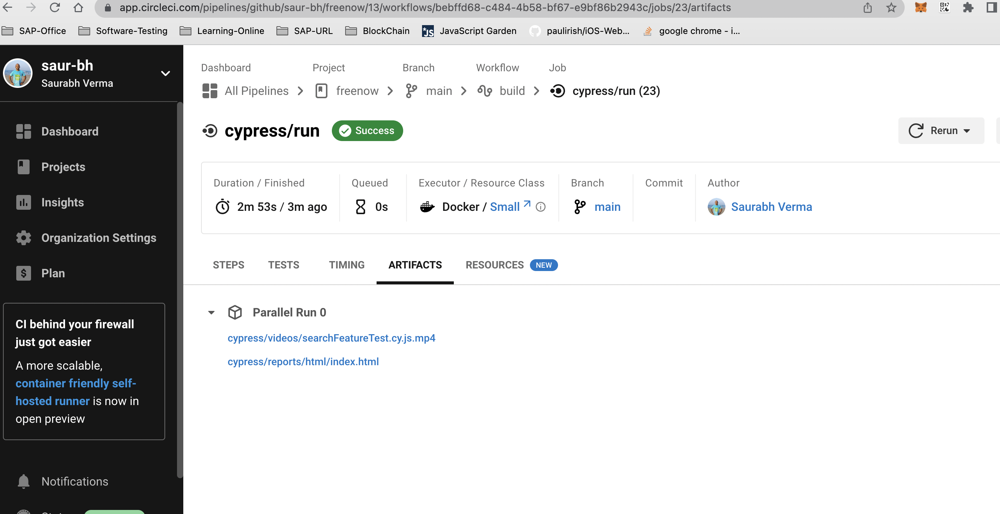

#  Wikipedia's application testing using cypress -RunBook
The test was conducted on web browser ( Chrome V105.0.5195.102 , Edge V105 and Electron V105)
## Pre-Condition 
Install node.js and npm on the system
* Windows https://phoenixnap.com/kb/install-node-js-npm-on-windows
* Mac https://www.newline.co/@Adele/how-to-install-nodejs-and-npm-on-macos--22782681
* Linux(ubantu) https://linuxize.com/post/how-to-install-node-js-on-ubuntu-18.04/

## Tech Stack 
- javaScript 
- cypress
- reporter mochawsome

## UseCase which are automated 
1. Verify Wikipedia's search feature.

## Demo
TDB

## Setup
* Navigate to desire location in your workstation and clone the project.
* Type command `git clone https://github.com/saur-bh/freenow.git` on the terminal. 
* Open the folder in your favourite editor or VsCode.
* Install dependencies by running `npm install`

## Running Tests

* To run all  or  individual tests via GUI, run `npm run cy:open`
* To run test in different configuration from command prompt, type `npm run cy:run:chrome | cy:run:edge |cy.run:electron`
* To run test in CI use following link 

## Creation of New Test
Our framework is based on the Page Object Model design pattern. 
- If required create paage, create new file in cypress/e2e/pages i.e. wikiPage.js which will extend BasePage.js. 
- Create new folder if not present under cypress/e2e/test for module which test has to be written 
- If module in present , create it block under specific test file.

## Viewing the Results 
 - Once test is run , result will be store in cypress/reports which is html file.
 - Execution video can be located in cypress/videos.
 - To get the CI result view select the pipeline and expand it, then select cypress/run and get into artifact tab.
 
 - Select the cypress/reports/html/index.html to view result 
 - Select cypress/videos/searchFeatureTest.cy.js.mp4 to view video playback
## Enhancement
  * Seperation of identifer in different folder.
  * Publish report via gitpages or on slack channel 
  * Automation bot to execute testSuite from slack or any other medium. 

